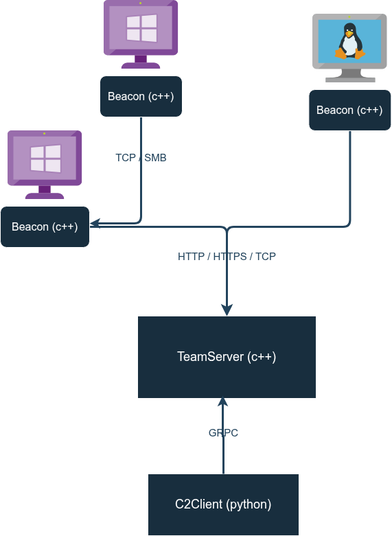

# Exploration C2 Framework

<p align="center">
  
</p>

## Overview

**Exploration** is a modular and extensible Command and Control (C2) framework designed for red team operations.  
This repository includes both the **TeamServer** (backend) and the **Client** (frontend).  

The latest release package contains:
- The C++ **TeamServer**
- The Python **Client**
- Windows modules and beacons from [C2Implant](https://github.com/maxDcb/C2Implant)
- Linux modules and beacons from [C2LinuxImplant](https://github.com/maxDcb/C2LinuxImplant)

To download the latest release, use the following command:

```bash
wget -q $(wget -q -O - 'https://api.github.com/repos/maxDcb/C2TeamServer/releases/latest' | jq -r '.assets[] | select(.name=="Release.tar.gz").browser_download_url') -O ./C2TeamServer.tar.gz \
&& mkdir C2TeamServer && tar xf C2TeamServer.tar.gz -C C2TeamServer --strip-components 1
```

## Look and Feel

<p align="center">
  
</p>


<p align="center">
  
</p>

## Architecture

The **TeamServer** is a standalone C++ application that manages listeners and active sessions.  
The **Client**, written in Python, interacts with the TeamServer via gRPC.

Beacons deployed on target machines initiate callbacks to the TeamServer, opening interactive sessions. These sessions can be used to send commands, receive output, and control implants.  
Supported communication channels for listeners and beacons include: `TCP`, `SMB`, `HTTP`, and `HTTPS`.

## Architecture Diagrams

<p align="center">
  
</p>

## Quick Start

### Running the TeamServer

A precompiled version of the TeamServer is available in the release archive. It includes default TLS certificates for gRPC and HTTP communication.

To launch the TeamServer:

```bash
cd Release
./TeamServer
```

<p align="center">
  
</p>

### Installing and Running the Client

Install the Python client using `pipx`:

```bash
pipx install git+https://github.com/maxDcb/C2TeamServer.git#subdirectory=C2Client
```

Set the path to the TeamServer certificate:

```bash
export C2_CERT_PATH=/path/to/teamserver/cert/server.crt
```

Connect to the TeamServer:

```bash
c2client --ip 127.0.0.1 --port 50051 --dev
```

> ⚠️ `--dev` disables hostname verification in the gRPC TLS certificate (for development/testing purposes).

## Documentation

For detailed usage, configuration, and module documentation, refer to the [Wiki](https://github.com/maxDcb/C2TeamServer/wiki).
