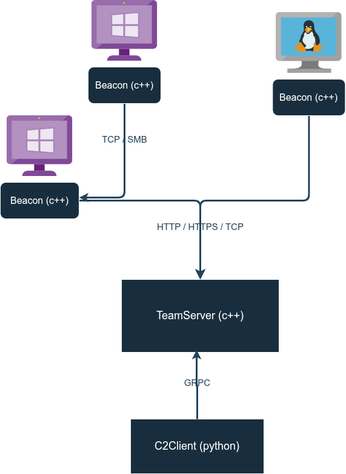

# **Exploration C2 Framework 🚀**

<p align="center">
  
</p>

## **📋 Overview**

**Exploration** is a modular and extensible Command and Control (C2) framework tailored for red team operations. This repository contains the backend **TeamServer** (written in C++) and the frontend **Client** (written in Python).

The latest release package includes:

* The C++ **TeamServer**
* The Python **Client**
* Windows modules and beacons from [C2Implant](https://github.com/maxDcb/C2Implant)
* Linux modules and beacons from [C2LinuxImplant](https://github.com/maxDcb/C2LinuxImplant)

---

## **👀 Look and Feel**

<p align="center">
  
</p>

<p align="center">
  
</p>

---

## **🏗️ Architecture**

The **TeamServer** is a standalone C++ application responsible for managing listeners and active sessions.
The **Client**, written in Python, communicates with the TeamServer through gRPC.

Beacons deployed on target machines initiate callbacks to the TeamServer, establishing interactive sessions. These sessions are used to send commands, receive output, and control implants.
Supported communication channels include: `TCP`, `SMB`, `HTTP`, and `HTTPS`.

### **🖥️ Architecture Diagram**

<p align="center">
  
</p>

---

## Repository Layout

The repository is kept as a monorepo for now, with boundaries aligned to the
future split target:

- `protocol/`: `.proto` source of truth and generated gRPC build rules
- `teamServer/`: server runtime and gRPC implementation
- `C2Client/`: Python client package and UI
- `core/`: source-shared C++ components reused by multiple projects
- `packaging/`: release bundle assembly
- `integration/`: staging area and future end-to-end tests

The historical directory names `teamServer` and `C2Client` are still present,
but the root build now treats them explicitly as the `server` and `client`
areas.

---

## **⚡ Quick Start**

### **🖥️ Running the TeamServer**

A precompiled version of the TeamServer is available in the release archive, which includes default TLS certificates for gRPC and HTTP communication.

To download the latest release, use the following command, or visit the [release page](https://github.com/maxDcb/C2TeamServer/releases):

```bash
wget -q $(wget -q -O - 'https://api.github.com/repos/maxDcb/C2TeamServer/releases/latest' | jq -r '.assets[] | select(.name=="Release.tar.gz").browser_download_url') -O ./C2TeamServer.tar.gz \
&& mkdir C2TeamServer && tar xf C2TeamServer.tar.gz -C C2TeamServer --strip-components 1
```

To launch the TeamServer:

```bash
cd Release
cd TeamServer
./TeamServer
```

---

### **🐳 Docker Deployment**

If you prefer containerized execution, the repository `Dockerfile` now runs the packaged TeamServer bundle directly:

```bash
docker build -t exploration-teamserver .
docker run --rm -it \
  --name exploration-teamserver \
  -p 50051:50051 \
  -p 80:80 \
  -p 443:443 \
  -p 8443:8443 \
  exploration-teamserver
```

The image downloads the latest `Release.tar.gz` during the image build and starts `/opt/teamserver/Release/TeamServer/TeamServer`.
If you want to override the packaged bundle with a local one, mount your own `Release` directory on `/opt/teamserver/Release`.

---

### **💻 Installing and Running the Client**

Install the Python client from the staged release bundle or from the repository sources.

If you use a staged release bundle, set the path to the TeamServer certificate:

```bash
export C2_CERT_PATH=/path/to/Release/TeamServer/server.crt
```

Then connect to the TeamServer:

```bash
c2client --ip 127.0.0.1 --port 50051 
```

---

## **📝 Building a Modern C2 — Blog Series**

Explore an in-depth, hands-on guide to developing a modern Command and Control (C2) framework. This series covers the architecture, design decisions, and implementation details of the **C2TeamServer** project.

🔗 [Read the full series here](https://maxdcb.github.io/BuildingAModernC2/)

---

### **📚 Series Overview**

* **Part 0 — Setup and Basic Usage**: Learn how to set up and launch your first Linux beacon.
* **Part 1 — TeamServer & Architecture**: Discover the build system, messaging choices, and listener management.
* **Part 2 — GUI & Operator Workflows**: Dive into the design goals and functionalities of the graphical user interface.
* **Part 3 — Beacons & Listeners**: Understand implant architecture and channel implementations.
* **Part 4 — Modules**: Explore module templates and implementation strategies.

---

The added emojis help bring some fun and engagement to the titles and sections, guiding the reader through the document while also visually highlighting the key parts.

## 🛠️ Build

The repository now uses:

- `Conan` for C/C++ dependencies
- `CMake` for configuration
- `GNU Make` or another CMake generator for compilation
- `pyproject.toml` and `requirements.txt` for Python dependencies

### 🔧 Build From Scratch

Validated commands in WSL/Linux:

```bash
git clone https://github.com/maxDcb/C2TeamServer.git
cd C2TeamServer
git submodule update --init --recursive

python3 -m pip install --upgrade "conan==2.24.0"

cmake -B build \
  -DCMAKE_PROJECT_TOP_LEVEL_INCLUDES=$PWD/conan_provider.cmake \
  -DCONAN_HOST_PROFILE=$PWD/conan/profiles/linux-gcc13 \
  -DCONAN_BUILD_PROFILE=$PWD/conan/profiles/linux-gcc13 \
  -DCONAN_LOCKFILE=$PWD/conan.lock
cmake --build build -j"$(nproc)"
ctest --test-dir build --output-on-failure
```

Notes:

- Use the absolute path to `conan_provider.cmake`. The old relative example was not reliable.
- The repository now ships a Linux/GCC 13 Conan profile in `conan/profiles/linux-gcc13` and a checked-in `conan.lock` to freeze the resolved dependency graph used in CI and documented local builds.
- Build artifacts are generated in the build tree, not written back into the repository root.
- The validated build currently runs `63` CTest tests from the root build, including one staged-runtime integration test.
- `libs/libDns/tests/fonctionalTest` is built but not registered in CTest because it is a manual server/client harness that requires explicit runtime arguments.

### 🧪 Client Tests

The client depends on the generated Python protocol package produced by the root CMake build:

```bash
sudo apt-get install -y \
  libegl1 \
  libgl1 \
  libxkbcommon-x11-0 \
  libxcb-cursor0 \
  libxcb-icccm4 \
  libxcb-image0 \
  libxcb-keysyms1 \
  libxcb-render-util0 \
  libxcb-xinerama0

cd C2Client
python -m venv .venv
. .venv/bin/activate
pip install -e .[test]

export C2_PROTOCOL_PYTHON_ROOT=$PWD/../build/generated/python_protocol
pytest tests -vv -s
```

### 📦 Stage A Release Bundle

To assemble the local release bundle from build outputs:

```bash
cmake --build build --target validate_release_bundle
```

The bundle is created under:

```text
build/release-staging/Release
```

This staged bundle contains:

- `TeamServer`
- `TeamServerModules`
- the generated Python client protocol package
- the Python client sources and launchers

The base TeamServer bundle is validated before it can be published. The
validation checks the TeamServer binary, runtime config, certificates, generated
client protocol package, and the complete `TeamServerModules` layout.

### Implant Release Layout

The TeamServer release also embeds validated release assets from:

- [C2Implant](https://github.com/maxDcb/C2Implant)
- [C2LinuxImplant](https://github.com/maxDcb/C2LinuxImplant)

The expected staged TeamServer release layout is:

```text
Release/
  TeamServer/
  TeamServerModules/
  Client/
  WindowsBeacons/
  WindowsModules/
  LinuxBeacons/
  LinuxModules/
```

The imported Windows implant archive must expose:

```text
Release/WindowsBeacons/
Release/WindowsModules/
```

or the same directories at the archive root:

```text
WindowsBeacons/
WindowsModules/
```

The imported Linux implant archive must expose:

```text
Release/LinuxBeacons/
Release/LinuxModules/
```

or the same directories at the archive root:

```text
LinuxBeacons/
LinuxModules/
```

Legacy `Release/Beacons` and `Release/Modules` layouts are intentionally not
accepted by the TeamServer CD pipeline. If an implant repository changes its
release contract, update the validation scripts and this section in the same
change.

To import and validate implant assets locally:

```bash
python packaging/import_implant_releases.py \
  --stage-root build/release-staging/Release \
  --import-root build/release-imports

python packaging/validate_release.py \
  --release-root build/release-staging/Release \
  --require-implants
```

By default the import script uses the latest GitHub release from each implant
repository. To avoid that moving target, pass explicit release tags:

```bash
python packaging/import_implant_releases.py \
  --stage-root build/release-staging/Release \
  --import-root build/release-imports \
  --windows-tag vX.Y.Z \
  --linux-tag vX.Y.Z
```

Create the final archive only from the validated staging directory:

```bash
tar -C build/release-staging -czf Release.tar.gz Release
```

### Prepare The Integration Runtime

The root build provides a dedicated preparation target for integration tests:

```bash
cmake --build build --target stage_integration_runtime
```

This produces a deterministic runtime under:

```text
build/integration-staging/runtime/Release
```

That staged runtime is already used by a first smoke integration test covering
TeamServer startup, gRPC authentication, and stable empty-state RPCs. It is the
base for the next round of end-to-end tests around the packaged Python client
and deeper contract validation.

## CI/CD Contract

The repository uses two GitHub Actions workflows:

- `CI` (`.github/workflows/Tests.yml`) runs on pull requests and branch pushes.
- `CD` (`.github/workflows/Release.yml`) runs on tags and manual dispatch.

The CI workflow:

- installs system dependencies, Python, Conan, and client test dependencies
  explicitly, including Qt runtime libraries required by `pytest-qt`;
- uses Conan and pip caches keyed from checked-in dependency files;
- configures a Release CMake build with tests enabled;
- builds the TeamServer and modules;
- runs CTest with failure output and a timeout;
- runs the Python client pytest suite with verbose output and a timeout;
- validates the staged TeamServer release bundle.

The CD workflow repeats the build and test gates, imports implant release
assets into staging, validates the complete release layout, creates
`Release.tar.gz` from staging, and publishes only that validated archive.

GitHub Actions permissions are read-only by default. `contents: write` is
granted only to the publish job that uploads the GitHub release asset.
